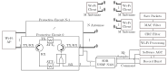
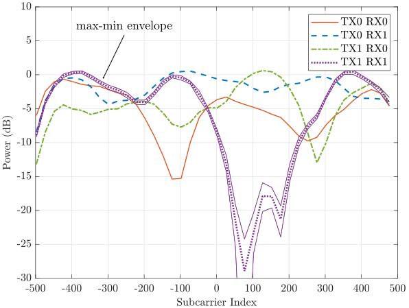
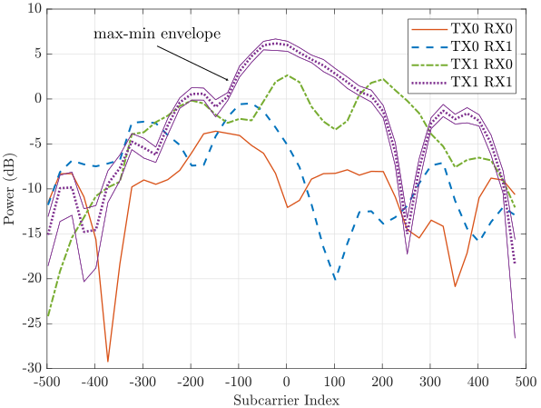

# Wi-Fi-channel-sounder
This testbed records Wi-Fi traffic and retrieves the channel state information (CSI). For this purpose, the RF signal is passively tapped at one of the network nodes, i.e. access point (AP) or client, and decoded in Matlab. This was tested for a Wi-Fi 6 system with 2x2 MIMO at 80 MHz channel bandwidth.

## Table of Contents
1. [Block Diagram](#block-diagram)

1. [Usage](#usage)

1. [Channel State Information](#channel-state-information)

1. [Further information](#further-information)

## Block Diagram
<p align="center">
  
</p>

We select an off-the-shelf Wi-Fi AP and split the received signal, which is then recorded with an SDR and decoded in Matlab. Between each antenna and each antenna port of the AP, a protective circuit with three ports is inserted, the purpose of which is to separate transmit and receive paths and to redirect half of the received RF signal into the SDR. Also, the protective circuits shield the USRP from excessive input power.

- **AP**: Asus RT-AX56U (2 antennas), up to 80 MHz bandwidth
- **Client**: Asus PCE-AX3000 (2 antennas)
- **SDR**: USRP N321
- **Circulator**: DiTom Microwave D3C4080
- **Software**: Matlab WLAN Toolbox

This is an image of the AP connected to the SDR:
<p align="center">
  
</p>

## Usage

### Host Computer

For 160 MHz Wi-Fi channels, the USRP needs to stream 200 MS/S at each receive path, which requires a fast host computer. To avoid under- and overruns:
- [UHD with DPDK](https://kb.ettus.com/Getting_Started_with_DPDK_and_UHD)
- low-latency kernel
- disable Hyper-threading
- disable frequency scaling, sleep states etc. ([HowTo0](https://kb.ettus.com/USRP_Host_Performance_Tuning_Tips_and_Tricks), [HowTo1](https://gitlab.eurecom.fr/oai/openairinterface5g/-/wikis/OpenAirKernelMainSetup#power-management))

### C++ record program

To record IQ samples we use the program in the folder ```record```:

    git clone https://github.com/maxpenner/Wi-Fi-channel-sounder.git
    cd Wi-Fi-channel-sounder
    mkdir build
    cd build
    cmake ../
    make
    
Depending on how the IP addresses of the USRP are configured, it may be necessary to change the corresponding line in ``utils/setup_record.sh``. Then the program can be started:

    cd Wi-Fi-channel-sounder/utils
    chmod +x setup_record.sh
    sudo ./setup_record.sh
    
The program awaits control commands from Matlab, which are sent via UDP. Each command contains the number of IQ samples, the center frequency and the LNA gains for the USRP.

### Matlab

Matlab provides the ``WaveformAnalyzer object`` which can be used to decode Wi-Fi signals. This also implies 802.11ax. The exact procedure is described [here](https://de.mathworks.com/help/wlan/ug/recover-and-analyze-packets-in-802-11-waveform.html).

To use the ``WaveformAnalyzer object`` this Matlab example can be used:

    openExample('wlan/AnalyzePacketsExample')
    
All files from the example must be copied into the folder ``process``. Since all information about the Wi-Fi packets are stored, the amount of data generated by the ``WaveformAnalyzer object`` must be reduced.

- **WaveformAnalyzer**: Add the properties from ``wfa_insert/WaveformAnalyzer_properties``
- **WaveformAnalyzer**: Add the function from ``wfa_insert/WaveformAnalyzer_methods`` to the class methods
- **WaveformAnalyzerEngine**: Add the contents of ``wfa_insert/WaveformAnalysisEngine_end_of_function_process`` at the end of the function ``process()``. It deletes the raw IQ samples.

Finally, the script ``process/A00_trigger_incoming.m`` can be executed. It records 100e6 IQ samples at a sampling rate of 100 MS/s, demodulates and decodes all Wi-Fi packets and saves the results in the folder ``process/data.m``.

## Channel State Information

This is an exemplary result for a CSI measurement. The power per subcarrier is shown. At 80 MHz and Wi-Fi 6, there are 996 subcarriers. The AP is connected to three clients, here the CSI of two of these clients is shown. The channel bandwidth is 80 MHz. Both AP and client have two antennas, therefore there are four different TX-RX paths in total.

The results are averaged over about 2000 packets to see how stable the channel measurement is. For one of the measurements the *max-min-envelope* shows what the maximum and minimum power of all packets is. The envelope is very close to the center average value, thus the measurement is stable.

<p align="center">
  
  
</p>
